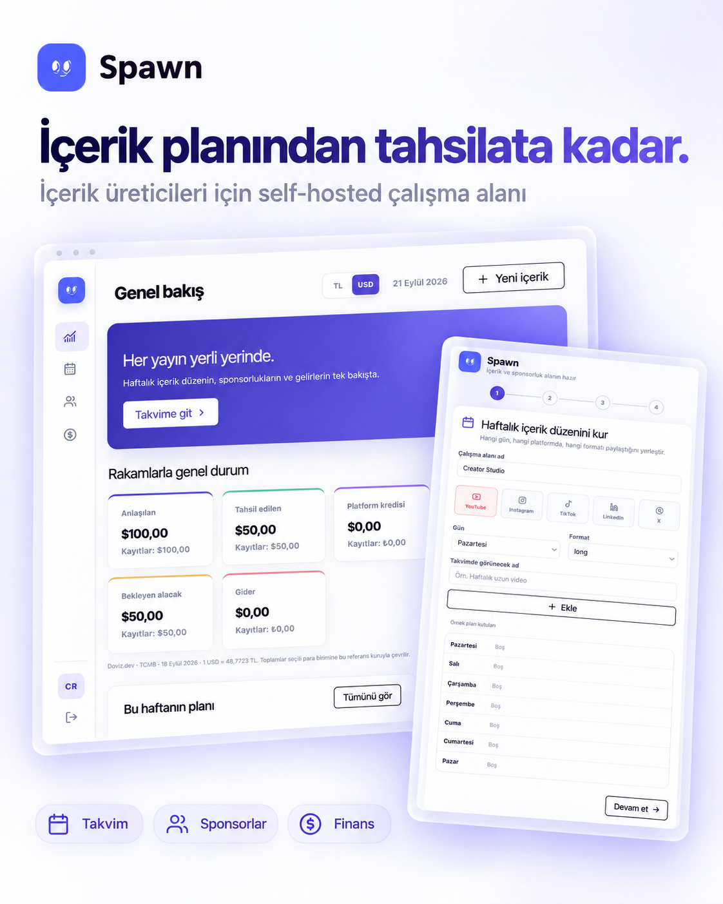
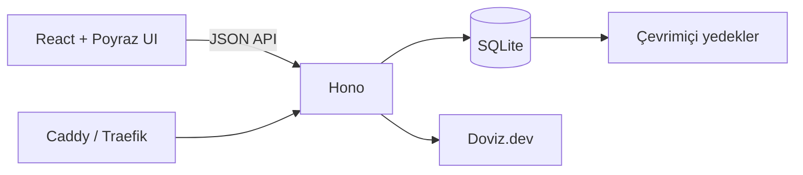

<div align="center">
  
  <h1>Spawn</h1>
  <p><strong>İçerik takvimin, sponsor anlaşmaların ve ödemelerin tek çalışma alanında.</strong></p>
  <p>Self-hosted · React · Poyraz UI · Hono · SQLite</p>
</div>



## İçerik üretirken asıl sorun içerik üretmek değil

YouTube, Instagram, TikTok, LinkedIn ve X için düzenli paylaşım yaparken planlar takvimde, sponsor konuşmaları mesajlarda, ödeme durumu ise banka hareketlerinde kalıyor. Bir süre sonra basit soruların cevabı zorlaşıyor:

- Bu hafta hangi içerikler yayımlanacak?
- Hangi sponsor için kaç içerik tamamlandı?
- Ne kadar ücret kararlaştırıldı, ne kadarı tahsil edildi?
- Hangi ödeme hâlâ bekleniyor?

Spawn bu süreci içerik planından tahsilata kadar tek yerde yönetir.

## Planla, yayımla, tahsil et

| Alan | Spawn ile yapabileceklerin |
| --- | --- |
| İçerik takvimi | Her platform için haftalık yayın düzenini oluştur, boş yuvaları ve gerçek içerikleri birlikte gör |
| Sponsor yönetimi | Marka profili, web sitesi, logo, notlar ve ilgili yayınları tek sayfada tut |
| Güvenli kaldırma | Sponsor veya içeriği görünümden kaldırırken geçmiş içerik ve finans kayıtlarını koru |
| Anlaşmalar | İçerik başına ücreti TL veya USD olarak kaydet |
| Finans | Tahsilat, platform kredisi, gider ve bekleyen alacağı ayrı takip et |
| Döviz | Doviz.dev üzerinden gelen TCMB referans kuruyla toplamları TL veya USD görüntüle |
| İlk kurulum | İkonlu onboarding ile takvimini, sponsorlarını ve geçmiş kayıtlarını birkaç adımda içeri al |

## İlk açılış sana göre şekillenir

Yeni kurulumlar boş başlar. Onboarding sırasında:

1. Çalışma alanına bir ad verirsin.
2. YouTube, Instagram, TikTok, LinkedIn ve X için haftalık yayın yuvalarını yerleştirirsin.
3. Sponsorlarını logo, bağlantı ve notlarıyla eklersin.
4. İstersen geçmiş içeriklerini ve finans hareketlerini içeri alırsın.

Kurulum tek bir veritabanı işlemiyle tamamlanır. Bir adım başarısız olursa yarım kayıt oluşmaz.

## Mimari



- **Arayüz:** React 19, TypeScript, Vite ve Poyraz UI
- **API:** Hono ve Node.js
- **Veri:** Better SQLite3, WAL modu ve sürümlü şema geçişleri
- **Kimlik doğrulama:** Scrypt parola karması ve HTTP-only oturum çerezi
- **Dağıtım:** Tek Docker imajı; Dokploy veya Docker Compose
- **Kalıcılık:** Uygulama imajından ayrı `/app/data` volume’u

## Hızlı başlangıç

Node.js 22+ ve pnpm 11 gerekir.

```sh
pnpm install
pnpm dev
```

Arayüz `http://localhost:5173`, API `http://localhost:3001` adresinde açılır. Yerel geliştirme ortamında ilk yönetici hesabını tarayıcıdan oluşturabilir, ardından onboarding akışını tamamlayabilirsin.

Tek porttan production derlemesini çalıştırmak için:

```sh
pnpm build
pnpm start
```

## Docker Compose ile self-host

```sh
cp .env.example .env
mkdir -p data
docker compose build app
docker compose run --rm app node dist/server/create-admin.js sen@ornek.com
docker compose up -d
```

`.env` dosyasında `APP_DOMAIN` değerini kendi alan adınla değiştir. Caddy HTTPS sertifikasını otomatik yönetir ve yalnızca 80/443 portlarını dışarı açar.

Veriler `./data` dizininde kalır. Uygulama imajını yenilemek SQLite dosyasını değiştirmez.

## Dokploy kurulumu

Yeni bir Application oluştur ve şu ayarları kullan:

| Ayar | Değer |
| --- | --- |
| Kaynak | Bu depo, `main` dalı |
| Build Type | Dockerfile |
| Environment | `NODE_ENV=production`, `PORT=3001`, `DATA_DIR=/app/data`, `APP_ORIGIN=https://alan-adin` |
| Volume | Adlandırılmış volume → `/app/data` |
| Domain | Konteyner portu `3001`, HTTPS açık |
| Replica | `1` |

İlk dağıtımda veritabanını volume içinde oluştur. Ardından konteyner terminalinde yönetici hesabını ekle:

```sh
node /app/dist/server/create-admin.js sen@ornek.com
```

Parola terminalde gizli istenir. İlk girişten sonra onboarding ekranı açılır.

## Güncelleme ve yedek

Docker Compose kurulumu için:

```sh
sh scripts/update.sh
```

Elle yedek almak için:

```sh
docker compose exec -T app node dist/server/backup.js
```

Yedekler `data/backups/` altında tutulur ve oluşturulurken SQLite bütünlük kontrolünden geçer. Üretimde bu klasörü düzenli olarak sunucu dışına da kopyala.

## Veri güvenliği

- SQLite WAL modu ve foreign key denetimi aktiftir.
- Şema yükseltmeleri transaction içinde çalışır.
- Mevcut veritabanı bulunamazsa production sunucusu boş bir sistemle sessizce başlamaz.
- Onboarding daha önce tamamlanmış bir çalışma alanında yeniden çalıştırılamaz.
- Aynı SQLite dosyasını birden fazla uygulama replikasına bağlamamak gerekir.

## Geliştirme kontrolleri

```sh
pnpm typecheck
pnpm test
pnpm build
```

Testler ilk kurulum, onboarding, haftalık takvim, finans hesapları, şema geçişleri ve veritabanı yeniden açıldığında kayıtların korunmasını kapsar.

## Lisans

Bu proje henüz bir açık kaynak lisansı yayımlamıyor. Kullanım koşulları için depo sahibiyle iletişime geçebilirsin.
